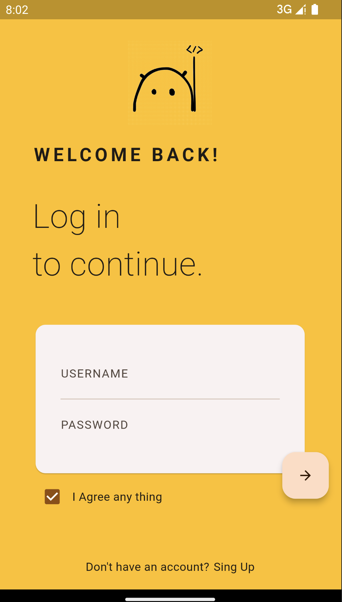

# Flutter应用的美学之旅：Material 3的一致与灵活
## 概述

作为程序员，我们在摸鱼之余时候都会有一些"天才"的想法需要实现，这时候我们往往会纠结于没有一个UI妹子来为我们做设计，自己做出来的Demo非黑即白，自己都下不去嘴，还要花大量的时间纠结每个控件的颜色（光是命名已经很痛苦了），又或者你喜欢绿色，但是暗黑模式应该用同样的颜色么？另外页面多起来的话，或者页面元素再丰富一些的时候，又或者你想换一些大胆明艳的颜色，就很难做到风格的一致和规范性了，MaterialDesign为这个问题提供了一个优秀的答案。MaterialDesign提供了一套强大的设计指南，为你的应用主题提供一致性和美观性的同时保证了可定制性，而且开发者无需为一些小细节费心，例如为每个控件指定颜色。

接下来我们一起学习如何将Material 3应用在你的Flutter应用中，原生应用的话也可以作为参考。

## 配置Material 3

我们先写一个朴素的登录页面布局，这里我们先不加任何的`Color`，看看效果如何


好像看着还行，这是因为Flutter默认启用了`Material 3`（`useMaterial3 ??= true;`），并且赋予了一个默认的`colorScheme`，通常我们都有一个自己的品牌色或者喜欢的颜色，我们可以通过创建一个`ThemeData`对象来尝试修改应用的主题色

```dart
ThemeData(
  useMaterial3: true,
  colorScheme: ColorScheme.fromSeed(
    seedColor: CustomColors.mainColor
  ),
)

class CustomColors {
  static const Color mainColor = Color(0xffffdcc3);
}
```

然后把`ThemeData`对象赋值给`MaterialApp`

```dart
import 'package:flutter/material.dart';
import 'package:flutter_material_design/sign.dart';
import 'package:flutter_material_design/themes/customColors.dart';

void main() {
  runApp(const MyApp());
}

class MyApp extends StatelessWidget {
  const MyApp({super.key});

  // This widget is the root of your application.
  @override
  Widget build(BuildContext context) {
    return MaterialApp(
      title: 'Flutter Demo',
      debugShowCheckedModeBanner: false,
      theme: ThemeData(
        useMaterial3: true,
        colorScheme: ColorScheme.fromSeed(seedColor: CustomColors.mainColor),
      ),
      home: SignPage(),
    );
  }
}
```

我们看看换了颜色的效果，这里我选了一个我比较喜欢的颜色`#ffdcc3`。


这里可以看到页面中的控件都根据新的`ColorScheme`改变了颜色。`ColorScheme`的作用就是根据你提供的颜色作为`seedColor`来生成一整套颜色主题，然后应用在不同的控件中。

## 暗黑主题

支持暗黑主题也很简单，创建一个新的`ThemeData`对象赋值给`darkTheme`：

```dart
MaterialApp(
  theme: ThemeData(
    useMaterial3: true,
    colorScheme: ColorScheme.fromSeed(
        seedColor: CustomColors.mainColor, brightness: Brightness.light),
  ),
  darkTheme: ThemeData(
    useMaterial3: true,
    colorScheme: ColorScheme.fromSeed(
        seedColor: CustomColors.mainColor, brightness: Brightness.dark),
  ),
  home: SignPage(),
)
```

然后我们把`themeMode`改成`dark`看看效果：

```dart
MaterialApp(
  themeMode: ThemeMode.dark,
  theme: ThemeData(
    useMaterial3: true,
    colorScheme: ColorScheme.fromSeed(
        seedColor: CustomColors.mainColor, brightness: Brightness.light),
  ),
  darkTheme: ThemeData(
    useMaterial3: true,
    colorScheme: ColorScheme.fromSeed(
        seedColor: CustomColors.mainColor, brightness: Brightness.dark),
  ),
  home: SignPage(),
)
```


## 主题定制化

有时候我们也会需要对Material 3的颜色进行修改，以满足一些特定控件的颜色需求或者为了让应用程序更靠近UI给的设计风格。

### ColorScheme

我们要改的话，第一个问题是Material 3这套设计规范到底根据我们给的`SeedColor`生成了颜色体系到底包含了哪些颜色？

```dart
primary: Color(0xFF335CA8),
onPrimary: Color(0xFFFFFFFF),
primaryContainer: Color(0xFFD8E2FF),
onPrimaryContainer: Color(0xFF001A42),
secondary: Color(0xFF00658E),
onSecondary: Color(0xFFFFFFFF),
secondaryContainer: Color(0xFFC7E7FF),
onSecondaryContainer: Color(0xFF001E2E),
tertiary: Color(0xFF715573),
onTertiary: Color(0xFFFFFFFF),
tertiaryContainer: Color(0xFFFCD7FB),
onTertiaryContainer: Color(0xFF2A132D),
error: Color(0xFFBA1A1A),
errorContainer: Color(0xFFFFDAD6),
onError: Color(0xFFFFFFFF),
onErrorContainer: Color(0xFF410002),
background: Color(0xFFF6F6F6),
onBackground: Color(0xFF1B1B1F),
surface: Color(0xFFFFFFFF),
onSurface: Color(0xFF1B1B1F),
surfaceVariant: Color(0xFFE1E2EC),
onSurfaceVariant: Color(0xFF44474F),
outline: Color(0xFF757780),
onInverseSurface: Color(0xFFF2F0F4),
inverseSurface: Color(0xFF303034),
inversePrimary: Color(0xFFAEC6FF),
shadow: Color(0xFF000000),
surfaceTint: Color(0xFF335CA8),
outlineVariant: Color(0xFFC5C6D0),
scrim: Color(0xFF000000),
```

数量也不是很多。。。大概可以归为以下几类

1. **Primary 和 Secondary 颜色**：这些颜色通常用于应用程序的主要元素，如按钮、工具栏和突出显示的部分。在Material Design 中，通常有一个主要颜色（primary）和一个辅助颜色（secondary）。

2. **Tertiary 颜色**：这些颜色通常用于应用程序的次要元素，如次要按钮或标签。

3. **Error 颜色**：这是用于表示错误状态的颜色。通常用于验证错误或应用程序中的问题指示。

4. **Background 和 Surface 颜色**：这些颜色用于应用程序的背景和表面元素，如卡片、面板和其他背景元素。

5. **Inverse 颜色**：这些颜色通常用于反向文本，即浅色文本放在深色背景上，或深色文本放在浅色背景上。

6. **Shadow 颜色**：这些颜色用于模拟元素的阴影。

7. **Outline 颜色**：这些颜色通常用于边框或轮廓。

8. **Scrim 颜色**：这些颜色用于创建遮罩效果，通常在对话框或抽屉背后使用。

**onXX**: 代表颜色之上的内容用的颜色，

**XXContainer**: A color used for elements needing less emphasis than [XX](https://api.flutter.dev/flutter/material/ColorScheme/primary.html).

`Color get primaryContainer => _primaryContainer ?? primary;`

你感受下，我理解下来就是whatever.

### copyWith ColorScheme

那么接下来我们试试修改页面的背景颜色`Background`

我们调用`ColorScheme`的`copyWith`方法，在参数中就可以指定你要修改的颜色。

```dart
colorScheme: ColorScheme.fromSeed(
            seedColor: CustomColors.mainColor,
            brightness: Brightness.light).copyWith(
              background: Colors.amber
            ),
```

看看效果：



### Material Theme Builder

另外Material 3官方提供了一个web工具来帮助你掌控这套颜色：[Material Theme Builder](https://m3.material.io/theme-builder#/custom)

1. 在Primary中依旧输入是输入你的品牌色，然后在右边的内容区就可以预览效果了


2. 点击网页右上角的Export按钮，我们可以导出生成的颜色
   
   

3. 可以看到下载完成的文件, `color_schemes.g.dart`包含了浅色主题和深色主题两套颜色, 以及教你如何集成的`main.g.dart`
   
   

4. 我们把颜色拷贝出来到一个单独的`AppThemeData.dart`中
   
   ```dart
   import 'package:flutter/material.dart';
   
   class AppThemeData {
   
     static ThemeData lightThemeData = buildThemeData(lightColorScheme);
   
     static ThemeData buildThemeData(ColorScheme colorScheme) {
       return ThemeData(
           useMaterial3: true,
           colorScheme: colorScheme
       );
     }
   
     // Color Refs to Android Material Design
     // https://m3.material.io/styles/color/the-color-system/color-roles
     // 动态主体生成工具 https://m3.material.io/theme-builder#/custom
     static const ColorScheme lightColorScheme = ColorScheme(
       brightness: Brightness.light,
       primary: Color(0xFF904D00),
       onPrimary: Color(0xFFFFFFFF),
       primaryContainer: Color(0xFFFFDCC3),
       onPrimaryContainer: Color(0xFF2F1500),
       secondary: Color(0xFF745944),
       onSecondary: Color(0xFFFFFFFF),
       secondaryContainer: Color(0xFFFFDCC3),
       onSecondaryContainer: Color(0xFF2A1707),
       tertiary: Color(0xFF5C6237),
       onTertiary: Color(0xFFFFFFFF),
       tertiaryContainer: Color(0xFFE1E7B0),
       onTertiaryContainer: Color(0xFF191E00),
       error: Color(0xFFBA1A1A),
       errorContainer: Color(0xFFFFDAD6),
       onError: Color(0xFFFFFFFF),
       onErrorContainer: Color(0xFF410002),
       background: Color(0xFFFFFBFF),
       onBackground: Color(0xFF201B17),
       surface: Color(0xFFFFFBFF),
       onSurface: Color(0xFF201B17),
       surfaceVariant: Color(0xFFF3DFD2),
       onSurfaceVariant: Color(0xFF51443B),
       outline: Color(0xFF847469),
       onInverseSurface: Color(0xFFFAEEE8),
       inverseSurface: Color(0xFF352F2B),
       inversePrimary: Color(0xFFFFB77D),
       shadow: Color(0xFF000000),
       surfaceTint: Color(0xFF904D00),
       outlineVariant: Color(0xFFD6C3B6),
       scrim: Color(0xFF000000),
     );
   
     static const ColorScheme dartColorScheme = ColorScheme(
       brightness: Brightness.dark,
       primary: Color(0xFFFFB77D),
       onPrimary: Color(0xFF4D2600),
       primaryContainer: Color(0xFF6E3900),
       onPrimaryContainer: Color(0xFFFFDCC3),
       secondary: Color(0xFFE3C0A6),
       onSecondary: Color(0xFF422C1A),
       secondaryContainer: Color(0xFF5A422E),
       onSecondaryContainer: Color(0xFFFFDCC3),
       tertiary: Color(0xFFC5CB96),
       onTertiary: Color(0xFF2E330D),
       tertiaryContainer: Color(0xFF444A21),
       onTertiaryContainer: Color(0xFFE1E7B0),
       error: Color(0xFFFFB4AB),
       errorContainer: Color(0xFF93000A),
       onError: Color(0xFF690005),
       onErrorContainer: Color(0xFFFFDAD6),
       background: Color(0xFF201B17),
       onBackground: Color(0xFFECE0DA),
       surface: Color(0xFF201B17),
       onSurface: Color(0xFFECE0DA),
       surfaceVariant: Color(0xFF51443B),
       onSurfaceVariant: Color(0xFFD6C3B6),
       outline: Color(0xFF9E8E82),
       onInverseSurface: Color(0xFF201B17),
       inverseSurface: Color(0xFFECE0DA),
       inversePrimary: Color(0xFF904D00),
       shadow: Color(0xFF000000),
       surfaceTint: Color(0xFFFFB77D),
       outlineVariant: Color(0xFF51443B),
       scrim: Color(0xFF000000),
     );
   }
   ```

5. 然后依旧是把`ThemeData`配置给MaterialApp
   
   ```dart
   MaterialApp(
     theme: AppThemeData.lightThemeData,
     home: SignPage(),
   )
   ```

6. 这样我们就在获取了整套Material 3标准的颜色主题后，根据需求灵活的调整对应的颜色值。

### WidgetTheme

有时候我们会希望在组件层面做到颜色的修改.

这里我们修改了`Card Widget` 和 `Text Widget`的颜色。

```dart
static ThemeData buildThemeData(ColorScheme colorScheme) {
    return ThemeData(
        useMaterial3: true,
        colorScheme: colorScheme,
        cardTheme: const CardTheme(color: Color(0xff006699)),
        textTheme: const TextTheme(
          titleLarge: TextStyle(
            color: Color(0xff006699),
            letterSpacing: 4,
            fontFamily: "Montserrat",
            fontWeight: FontWeight.bold,
            fontSize: TEXT_LARGE_SIZE,
          ),
        ));
  }
```

效果好像一般。。


### WidgetStyle

如果我们希望在具体的某个`Widget`中去覆盖主题中的样式的话，可以参考下面代码：

```dart
Text("WELCOME BACK!",style: 
    Theme.of(context).textTheme.titleLarge!.copyWith(color: Colors.black87)
)
```

这样我们就可以在`WidgetTheme`的基础上做局部的样式修改。

### TextTheme

`ThemeData`还可以指定应用中所有字体的大小，字重等样式：

```dart
static ThemeData buildThemeData(ColorScheme colorScheme) {
    return ThemeData(
        useMaterial3: true,
        colorScheme: colorScheme,
        textTheme: _textTheme
  }

static final TextTheme _textTheme = TextTheme(
    titleLarge: GoogleFonts.montserrat(fontWeight: _bold, fontSize: 16.0),
    titleMedium: GoogleFonts.montserrat(fontWeight: _medium, fontSize: 16.0),
    headlineMedium: GoogleFonts.montserrat(fontWeight: _bold, fontSize: 20.0),
    bodySmall: GoogleFonts.oswald(fontWeight: _semiBold, fontSize: 16.0),
    headlineSmall: GoogleFonts.oswald(fontWeight: _medium, fontSize: 16.0),
    labelSmall: GoogleFonts.montserrat(fontWeight: _medium, fontSize: 12.0),
    bodyLarge: GoogleFonts.montserrat(fontWeight: _regular, fontSize: 14.0),
    titleSmall: GoogleFonts.montserrat(fontWeight: _medium, fontSize: 14.0),
    bodyMedium: GoogleFonts.montserrat(fontWeight: _regular, fontSize: 16.0),
    labelLarge: GoogleFonts.montserrat(fontWeight: _semiBold, fontSize: 14.0),
  );
```

## 结尾

是不是Material 3这套设计还不错，让你们公司的UI在figma上安装Material的插件体检下它的魅力吧。

最后，有任何问题都可以在评论区一起交流。